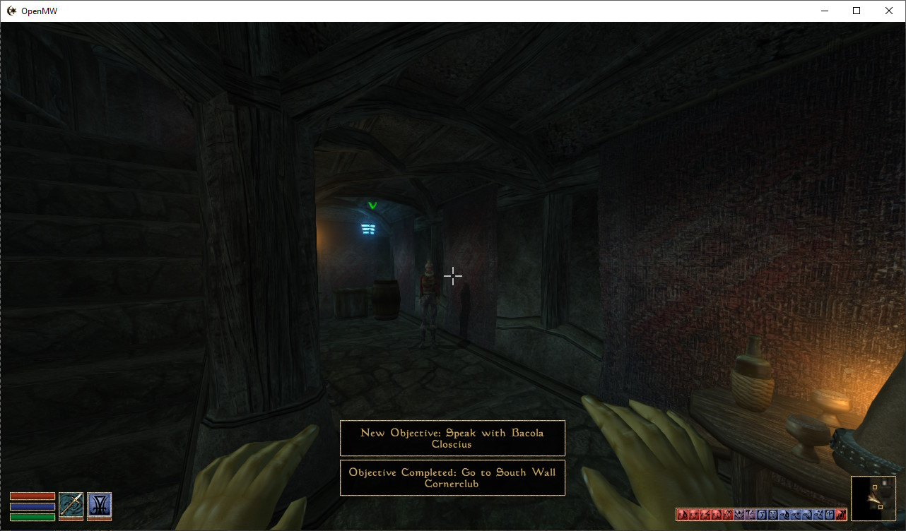

# OpenMW Quest Markers

This mod adds Skyrim-style quest markers, objectives and notifications to OpenMW.

     

[see a video of it in action on Twitter](https://x.com/mildbyte/status/1887997189298725334)

## Features

- Hand-crafted database of quests, their objectives and locations
- Separate quest log UI that allows you to track/untrack quests and see your current objective (press V)
- Automatic routing to objectives, including through other cells, interiors, in-game travel and Guild teleports using a pre-computed graph
- Objective marker projected on your HUD, pointing at the next travel NPC/door/destination
- Notifications when you complete/start an objective/quest
- Plug-and-play, no need to start a new game and doesn't store any data in your savefile
- Only uses Lua and doesn't edit in-game quest definitions

## Limitations

This mod is in early development. Right now, you can go through the main quest up to the Great House Hortator section, with proper objectives and markers.

For other quest lines and for the rest of the main quest, I only automatically imported their journal entries into the objective database, so each journal update will be treated as an objective completion and you won't get any quest markers. I plan to add objectives for all base Morrowind quests and then move on to Tribunal/Bloodmoon/Tamriel Rebuilt.

Other limitations include:

### Planned to fix

- Quest objectives are linked to a player journal stage, so objectives like "Kill X" or "Find Y" are unsupported.
- Quest pointers can only point to NPCs or interior cell clusters (e.g. an objective can point to Caius Cosades or the "interior cluster" of cells connected to Arkngthand, but not at a certain item or even at a creature like Dagoth Ur).
- When you approach a travel NPC, you don't actually know where you're meant to ask them to take you. The routing subsystem knows it but it's not shown in the UI.
- Markers are sometimes misaligned (pointing at door corners, NPC's legs).
- Quest lines are not continuous: you have to start the next quest in a questline to get the markers again.
- Navigation doesn't take into account Mark/Recall, Almsivi/Divine Intervention or Propylon indices.
- Navigation doesn't update when you move around a cell, only when you change cells (press X to refresh it).

### Not planned to fix

- The travel graph is pre-computed, so any mods that alter the game map or move travel provider NPCs around will break this mod's navigation.
- The objectives are hand-crafted, which means I have to manually go through each questline and judge what's considered an objective and what the quest pointer should point to at that stage.
- This mod doesn't know about any quests from Tribunal, Bloodmoon, Tamriel Rebuilt or other mods, so those quests won't be displayed in your quest log and you won't get notifications for them.
- Quest markers don't show up on the global/local maps and probably never will (there's no API for that in OpenMW).

## Kinda ruins the game?

Morrowind is definitely designed to work without quest markers and this mod can mess with the experience of immersing yourself in the game world and navigating just based off of NPC-provided directions.

I thought it would be a fun technical challenge to build it anyway and tried to make it not completely game ruining. For example, in the [Path of the Incarnate](https://en.uesp.net/wiki/Morrowind:The_Path_of_the_Incarnate) quest, it won't point you at the actual cavern until you've talked to the Ashlanders to decode the riddle.

## Requirements and installation

**Needs OpenMW 0.49 release candidate** (relies on it for Lua API version 70 with some journal access API). You can grab it from the [OpenMW releases page](https://github.com/OpenMW/openmw/releases/).

Download a prebuilt versions from the [GitHub build artifacts](https://github.com/mildbyte/openmw-skyrim-quest-markers/actions?query=branch%3Amaster).

Use the [OpenMW mod installation guide](https://openmw.readthedocs.io/en/stable/reference/modding/mod-install.html) to install the mod.

To bring up a quest overlay and mark quests as tracked/untracked: press V

To refresh navigation in some cases where it doesn't refresh (especially when the best route to your objective changes as you moved around an exterior cell): press X

The mod doesn't save any state into your saved game (it only reads your quest log and global NPC positions), so it's safe to add or remove it and it doesn't require a new game.
